# Reverse Engineering ASIC Puzzle Write Up

## Summary:

I started out with writing a Python library to recover the netlist from the `.gds` file and to perform analysis + simulations on that netlist. In the middle, I had the idea to make a game out of it, to make it more interactive and visual, so the project changed trajectories half-way through. The game aims to support all the functionality that was implemented for the Python library, and is purely in-browser, statically deployed to [rates37.github.io/gdsx](https://rates37.github.io/gdsx). The game contains both the original puzzle from the challenge, and a set of additional ones that vary in difficulty and design.

My reverse engineering process involved a lot of trial and error, manual inspection, and simulation of the netlist to get some insights as to its structure and behaviour. The design validates an 11x11 two-star game board, and upon the correct pattern being applied, it outputs the message `(* TWO STARS *)` in ASCII on `O[7:0]`.

This write up mostly focuses on how the game/web UI was used to reverse engineer the puzzle. My original approach was purely using the Python library/cli, and can be read (along with my internal monologue) in [docs/journal.md](journal.md). Both approaches are essentially the same, however the game provides a more visually intuitive way to understand what I did.

AI was used primarily for cleaning up code and scripts written by hand, and implementing the game/web UI, since I have little prior game dev and web dev experience. All the write up / markdown documentation is hand written.

## Netlist extraction:

The first step is to go up an abstraction layer, as deciphering gates/primitives is much easier than just looking at silicon/metal. Netlist extraction is the one part that happens only in the Python library (and doesn't happen in the game), as it relies on KLayout for parsing the `.gds` file and recovering each component, and I didn't want to ship KLayout as well (wanted the game to be in-browser and small).

Routing is essentially a connected component problem. Any two metal components that physically touch are on the same net in the netlist. To get a more abstract graph-like representation of the circuit, any metal routing needs to be converted into a single wire/net in the netlist. This includes wires connected by vias and between metal layers.

### Per-Layer Merging

Using KLayout, the `Region.merged()` method does this. For each routing layer (`li1`, `met1`, etc.), each region gets a unique ID. Approximately:

```py
for rl in design.tech.routing:
    region = (_region(design, rl.drawing) + _region(design, rl.pin)).merged()
    polys, ids = [], []
    for poly in region.each():
        polys.append(poly)
        ids.append(uf.add())  # Assign a cluster ID
    conn.index[rl.name] = PointIndex(polys, ids)
```

### Via Stitching:

After clustering connected nets per-layer, use the vias to merge clusters across layers. For each via:

1. Find the cluster it overlaps on the layer above
2. Find the cluster it overlaps on the layer below
3. Merge them

I used a Union-Find with path compression and union-by-size to perform this in amortised $\mathcal{O}(\alpha(n))$ per operation.

```py
for via in design.tech.vias:
    for poly in _region(design, via.layer).merged().each():
        pt = poly.bbox().center()
        lo = conn.cluster_at(via.below, pt)
        hi = conn.cluster_at(via.above, pt)
        if lo is None or hi is None:
            conn.dangling_vias.append((via.name, pt))  # Error tracking
            continue
        uf.union(lo, hi)  # Merge clusters
```

### Spatial Indexing:

The nets need to eventually be used to determine what net each pin of a primitive (gate/standard cell) belongs to. So we need to be able to answer queries of the form "given coordinate `(x,y)` on layer `L`, what net is that point connected to?"

Iterating through all clusters was insanely slow, so instead I used a spatial index `PointIndex` to break down the area into smaller regions. This allows only checking the nets that are within a certain region, and using an appropriate grid size, speeds up the queries significantly:

```py
class PointIndex:
    def __init__(self, polygons: list[db.Polygon], ids: list[int]):
        self.polygons = polygons
        self.ids = ids
        self.buckets: dict[tuple[int, int], list[int]] = defaultdict(list)
        for i, poly in enumerate(polygons):
            bb = poly.bbox()
            for bx in range(bb.left // BUCKET, bb.right // BUCKET + 1):
                for by in range(bb.bottom // BUCKET, bb.top // BUCKET + 1):
                    self.buckets[(bx, by)].append(i)

    def lookup(self, pt: db.Point) -> int | None:
        for i in self.buckets.get((pt.x // BUCKET, pt.y // BUCKET), ()):
            poly = self.polygons[i]
            if poly.bbox().contains(pt) and poly.inside(pt):
                return self.ids[i]
        return None
```

### Mapping Instance Pins to Nets:

For each gate instance, we need to determine what net each pin lies on. For each instance:

1. Get its position and orientation
2. Get the name, layer, and position (relative to the instance) of each pin
3. Transform the point to global coordinates
4. Query the index to get the net ID
5. Record the mapping from `pin_name` to `net_id`.

At this point, the netlist is represented in a graph-like data structure, and can be exported to JSON, gate-level Verilog, etc.

From here, the write up will be more high-level, using the game rather than discussing the code implementations, as for the most part, the code implements trivial netlist simulation and graph traversal algorithms, both of which are well known and not particularly the thing of importance here. For more info on the implementation details, see [docs/journal.md](journal.md), where I documented the approaches used.

## Walking `success`'s fan-in cone:

The Cone Walker tab lets you select a net and walk its fan-in or fan-out cone, to see other signals that the chosen net depends on / drives. Selecting the `success` net and walking its fan-in cone, it depends on a single node, the `flop Q` of a flip flop (FF). Specifically, the `Q` output of `dfrtp_2_83`.

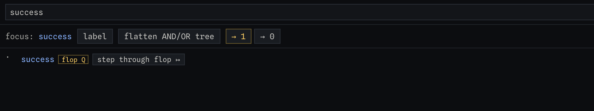

The cone walker intentionally stops at FF boundaries, but using the "step through flop" button, it is possible to cross the boundary. The cone walker re-roots at `dfrtp_2_83` and shows its fan-in:

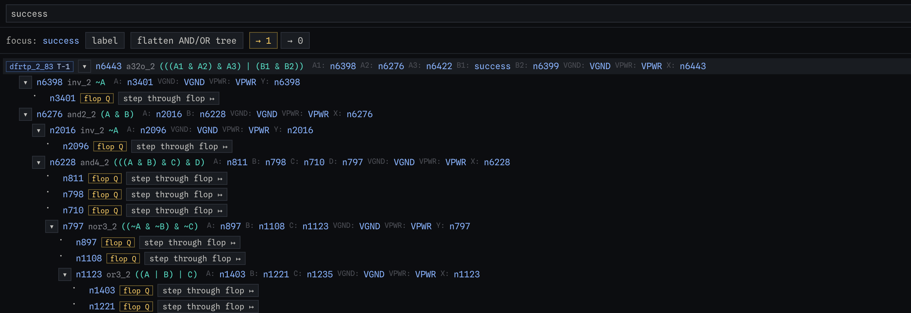

Reading the first gate:

```
n6443   a32o_2   (((A1 & A2) & A3) | (B1 & B2))
  A1: n6398   A2: n6276   A3: n6422
  B1: success B2: n6399
```

All net names here (other than port names) are given arbitrary node IDs by the netlist extraction, all in the form `n<number>` (these are not guaranteed to be stable across different extractions if the extraction algorithm changes). B1 is the `success` net itself, so it seems like success can hold itself on, or at least provides some form of feedback to its own driver.

Since the D input of `dfrtp_2_83` is the expression `(((A1 & A2) & A3) | (B1 & B2))`, where `B1` is success itself, that means the first time it goes high must be due to the `(A1 & A2 & A3)` part of the expression.

Continuing to step back and use this analysis approach can give more insights.

### Flattening Netlist

The "flatten AND/OR" button reduces the cone below the selected net into a flat list, split into:

- forced: every possible way to reach the value requires this condition/value

- choices: any of the options listed here can be used to satisfy the condition. Each leaf shows a tick or cross indicating whether it is satisfied or not

Flattening `n6443` with it being forced to 1 gives:

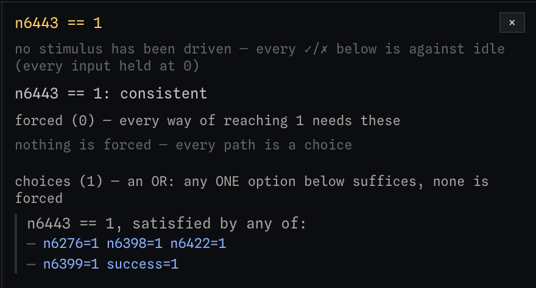

This says it relies on `n6276`, `n6398`, and `n6422` being high (that's the `A1 & A2 & A3` component of the expression), or `n6399` and `success` being high (the `B1 & B2` part).

Flattening each of these branches for the A input ports (`n6276`, `n6398`, `n6422`):

`n6398`, one forced leaf, 0 choices

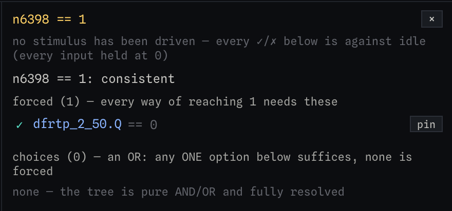

`n6276`, nine forced leaves, 0 choices

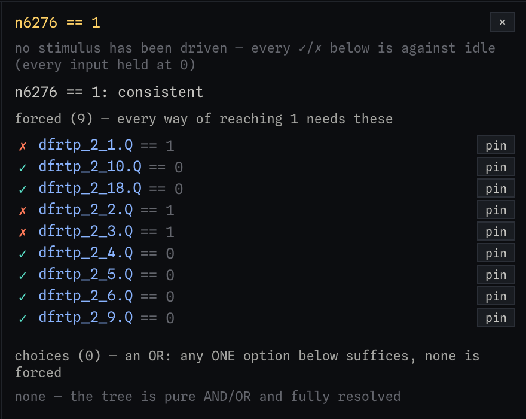

`n6422`, forty-six forced leaves, 0 choices. All leaves are FF `Q` outputs

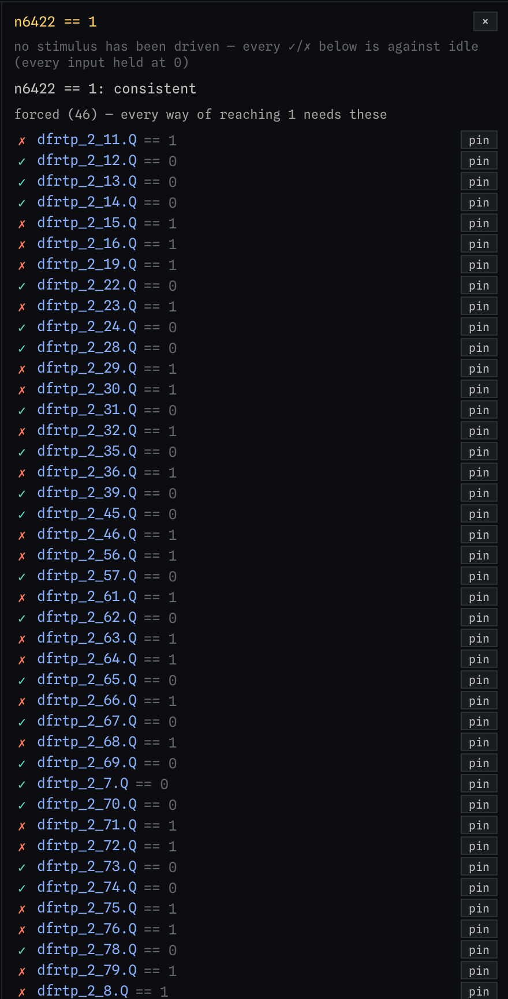

This can be a little overwhelming at the start, but this essentially gives an exact set of FFs and what value they need to be in order to drive `success` high.

In total, that's 56 FF values.

## Register analysis and Experiments:

The "experiments" tab allows you to set a baseline and then apply perturbations to the inputs to see which flops are sensitive to the change.

The "single pulse sweep" with the baseline idle (all inputs at their default/initial values) allows us to see which FFs are sensitive to a single pulse on the input, I, over time, essentially giving an impulse-response-like view of the circuit behaviour.

This gave the two warnings:

- "49 watched elements never reacts": this just means a 1-cycle pulse over the entire simulation doesn't cause those to trigger (they could be sensitive to more complex input patterns than only one pulse).

- "20 runs move no watched element": this simulation was run for 141 cycles, and the last 20 didn't cause any watched elements to change

The sensitivity matrix shown was:

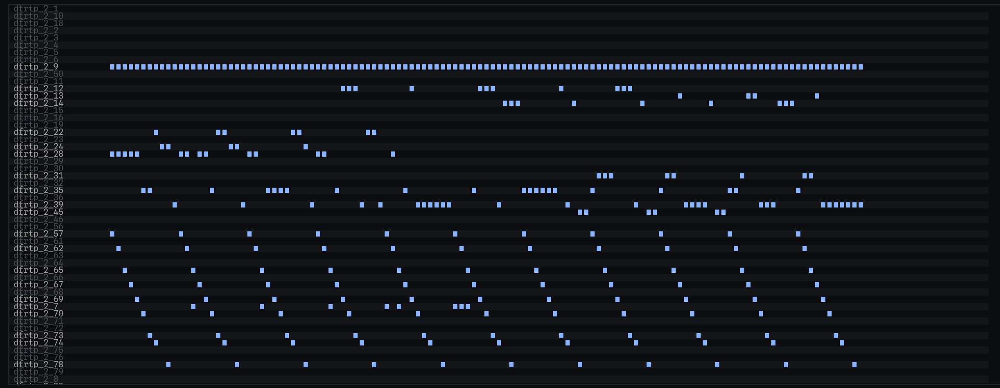

We can see a lot of the FFs are sensitive on a periodic basis (period of 11), and in the simulation there are 11 full periods of this 11-cycle behaviour.

It also provides a neat summary of the FFs that are sensitive and on which pulses they are sensitive.

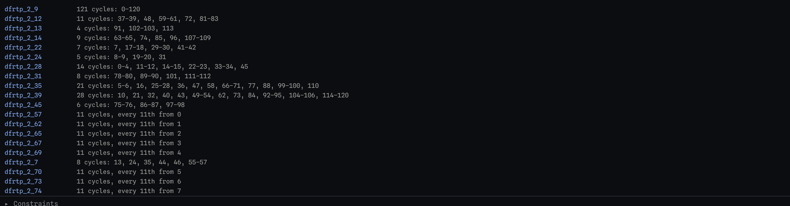

Of the 56 watched FFs, only 23 actually react to this single pulse sweep. One is special - `dfrtp_2_9` reacts on every pulse.

One set of 11 FFs reacts on a period 11-cycle basis, every 11ith pulse from pulse `i`, summarised:

| flop            | `57` | `62` | `65` | `67` | `69` | `70` | `73` | `74` | `80` | `78` | `81` |
| --------------- | ---- | ---- | ---- | ---- | ---- | ---- | ---- | ---- | ---- | ---- | ---- |
| every 11th from | 0    | 1    | 2    | 3    | 4    | 5    | 6    | 7    | 8    | 9    | 10   |

Another set of 11 FFs react on irregular sets of pulses, summarised:

| flop         | count | cycles                                                         |
| ------------ | ----- | -------------------------------------------------------------- |
| `dfrtp_2_39` | 28    | 10, 21, 32, 40, 43, 49–54, 62, 73, 84, 92–95, 104–106, 114–120 |
| `dfrtp_2_35` | 21    | 5–6, 16, 25–28, 36, 47, 58, 66–71, 77, 88, 99–100, 110         |
| `dfrtp_2_28` | 14    | 0–4, 11–12, 14–15, 22–23, 33–34, 45                            |
| `dfrtp_2_12` | 11    | 37–39, 48, 59–61, 72, 81–83                                    |
| `dfrtp_2_14` | 9     | 63–65, 74, 85, 96, 107–109                                     |
| `dfrtp_2_7`  | 8     | 13, 24, 35, 44, 46, 55–57                                      |
| `dfrtp_2_31` | 8     | 78–80, 89–90, 101, 111–112                                     |
| `dfrtp_2_22` | 7     | 7, 17–18, 29–30, 41–42                                         |
| `dfrtp_2_45` | 6     | 75–76, 86–87, 97–98                                            |
| `dfrtp_2_24` | 5     | 8–9, 19–20, 31                                                 |
| `dfrtp_2_13` | 4     | 91, 102–103, 113                                               |

These sets are notably disjoint, and the union of them includes every pulse number from 0 to 120 (inclusive).

## Automatic Register Grouping/Identification:

This feature/tab is sort of experimental, needs work/refinement, but still provides meaningful/useful info to help.

By default, it tries to group registers based on their input signals/dependencies. It shows two "registers", an 88-bit accumulator and a 4-flop state register. Neither of which are particularly useful.

Pasting the 56 registers into the "ad-hoc grouping" box allows the tool to inspect only those registers to try and find meaningful groupings/dependencies. Using the 56 registers that `success` depends on and clicking "group" runs mutual dependency grouping over those FFs.

### The 2-Bit Pairs:

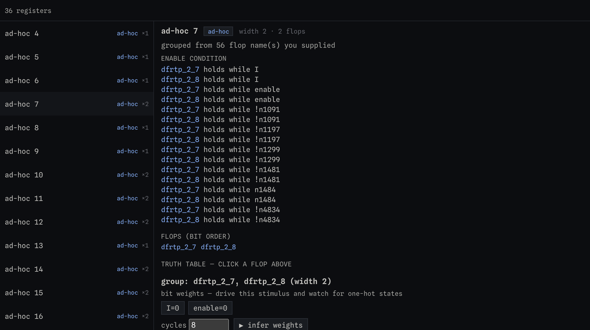

Each group can be clicked to view more info about the inferred group. Of those groups, 22 groups are pairs, 2-bit counters:

```
[_7,_8]   [_11,_12] [_13,_15] [_14,_16] [_19,_24] [_22,_23] [_28,_29] [_30,_31]
[_32,_35] [_36,_39] [_45,_46] [_56,_57] [_62,_63] [_64,_65] [_66,_67] [_68,_69]
[_70,_71] [_72,_73] [_74,_75] [_76,_78] [_79,_80] [_81,_84]
```

And the other 12 are singletons (or could not be meaningfully grouped): `_1 _2 _3 _4 _5 _6 _9 _10 _18 _50 _61 _82`.

Cross referencing these pairs with the sensitivity matrix from the single pulse sweep, exactly one of the two registers in each pair is sensitive to a single pulse, while the other is not sensitive at all. The bit that reacts in each pair is the LSB of the 2-bit counter, while the MSB is the FF that didn't react.

In the requirements for `success` to go high (from the previous sections), it requires the LSB to be zero, but the MSB to be 1. I.e., every counter needs to count to 2.

Using the groupings and prior sweeps, we can summarise the 2-bit counters into two sets A and B:

| Set                                                    | tally      |
| ------------------------------------------------------ | ---------- |
| A counts by position `i = cycle mod 11`                | 11 x 2-bit |
| B counts by the disjoint groups in the ad-hoc grouping | 11 x 2-bit |

### 8-bit I-pulse counter:

Eight of the remaining 12 registers group together into a single 8 bit counter. `dfrtp_2_9` reacted every cycle of the pulse sweep, and is the LSB. The other 7 registers naturally never reacted at all, since the sweep only ever tested I being pulsed for a single clock cycle per trial. Adding those 8 registers to the waveform viewer to determine their ordering:

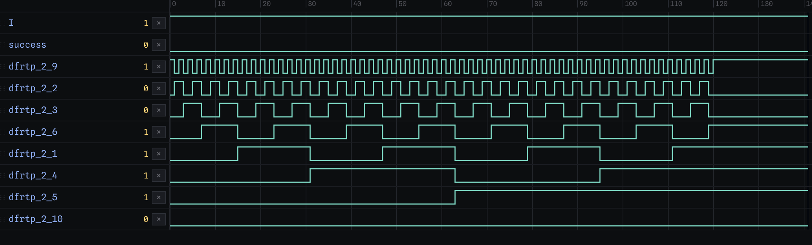

Since the design only reacts for the first 121 clock cycles, the 8th bit is never set (since the counter never reaches 128).

Going back to when we flattened the `n6276` tree, its requirements all depend on the 8-bit counter registers being in the states:

`_1 == 1, _10 == 0, _18 == 0, _2 == 1, _3 == 1, _4 == 0, _5 == 0, _6 == 0, _9 == 0`.

Aside from register `_18`, this is the binary representation of 22 (if reading off of the 8-bit counter). This is the first really high level description that has been recovered so far: for `n6276` to be high, the 8-bit counter needs to be at 22, i.e., exactly 22 pulses on I are required in the first 121 cycles.

### Sticky FFs:

Now we just have 4 registers left to decode. The "Sticky flops" sub tab in the register tab shows all the one-way latches in the design (as in latches that can only be set but not reset), as well as what the win condition requires of it / suggests it is (e.g., in order for success to be high, does the sticky FF need to be set (a checkpoint), or never be set(a trap)).

Looking at the 4 unexplained flops:

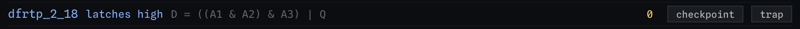
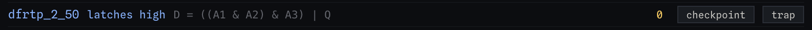
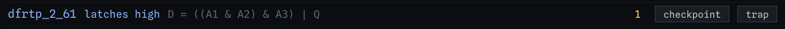
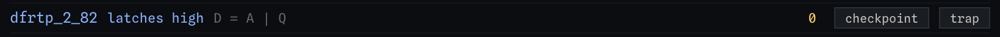

All expressions are clearly sticky due to the `| Q` in their D-input expressions. `_82`'s D-input is `_61`, so it's just delaying the sticky behaviour of `_61` by one cycle. Since we require `_61` to be 1 and `_82` to be 0, that means `_61` must be set on exactly the last cycle of the 121 cycles. However, under the idle (all 0) input pattern, this already happens exactly, and no input pattern causes any different.

## Gap Sweeps:

Register `_50` is a trap, but did not react to a single pulse on any cycle. So there must be some more complex input pattern or sequence property that causes it to trigger. Going back to the experiments menu, and using a "gap sweep" experiment (a pair of pulses at given starting cycles and given spacings, compared with the baseline).

Using the settings:

- first from 0 to 23
- gaps from 1 to 25
- "watch these signals" = `dfrtp_2_50`

This ran 600 simulations, 89 of which trigger it to be set. Grouping by first pulse we see:

```
first= 0      trapped gaps: 1, 11, 12
first= 1-9    trapped gaps: 1, 10, 11, 12
first=10      trapped gaps: 10, 11
first=11      trapped gaps: 1, 11, 12
first=12-20   trapped gaps: 1, 10, 11, 12
first=21      trapped gaps: 10, 11
first=22      trapped gaps: 1, 11, 12
first=23      trapped gaps: 1, 10, 11, 12
```

Put in more understandable terms, it traps if the gap between two pulses is 1, 10, 11, or 12.

## `dfrtp_2_18` and `dfrtp_2_61`:

`dfrtp_2_18` is a trap, but it is also already set under the all-0 input pattern, so it doesn't show up in the pulse sweeps because it doesn't change. That is, the trap is set by default, and there must be some input sequence property that causes it not to trigger, which we need to identify in order to make `success` go high.

Exploring in the waveform/simulator, the behaviour of `dfrtp_2_18` depends on the number of pulses within each 11-cycle period. Referring to each 11-cycle period as an "epoch", the following was observed:

| pulses in an epoch | `_18` 11 cycles after epoch start |
| ------------------ | --------------------------------- |
| (none)             | 1                                 |
| `[0]`              | 1                                 |
| `[3]`              | 1                                 |
| `[10]`             | 1                                 |
| `[0, 3]`           | 0                                 |
| `[2, 5]`           | 0                                 |
| `[1, 4]`           | 0                                 |
| `[0, 3, 6]`        | 1                                 |
| `[0, 4, 8]`        | 1                                 |
| `[0, 3, 6, 9]`     | 1                                 |
| `[0, 2, 4, 6, 8]`  | 1                                 |

So it seems that `_18` is set if the number of pulses in an epoch is anything other than 2.

## Setting Constraints and Recovering Solution:

Summarising the constraints observed so far:

- per epoch: exactly 2 pulses
- spacing: gap between pulses must not be 1, 10, 11, or 12
- groupings: exactly 2 pulses in each of the 11 disjoint groups of 2-bit counters

In the "constraints" section of the bottom of the experiments tab, we can set these rules and search for a bit pattern that satisfies all of them.

Using the " -> Constraints" button in the experiment results view, we can add constraints to the constraints list, and set the number of pulses for each group to exactly 2. In total, 35 constraints. Clicking solve runs a DFS search and finds exactly 1 solution in about a second (if there's multiple, then it returns the first 50 it finds before terminating the search):

`{7, 9, 11, 16, 29, 31, 33, 35, 48, 50, 57, 63, 70, 76, 78, 83, 91, 98, 104, 107, 111, 113}`

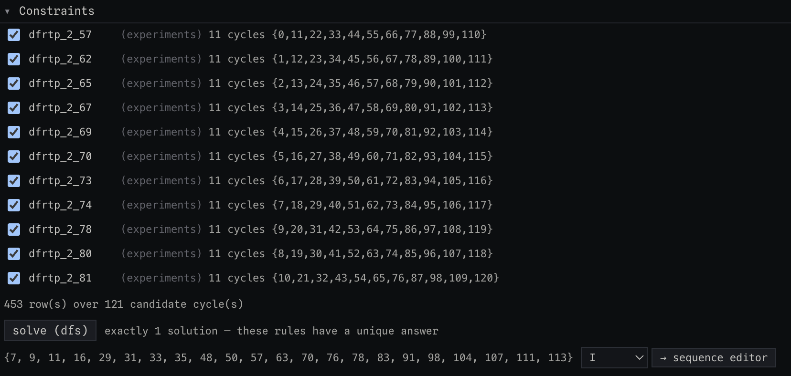

(note not all constraints fit in the same screenshot)

Clicking the " -> Sequence Editor" button copies the candidate into the `I` input on the sequence editor, with 1s at the positions specified by the solution and 0s everywhere else, and now shows the `success` output going high at the end of cycle 120:

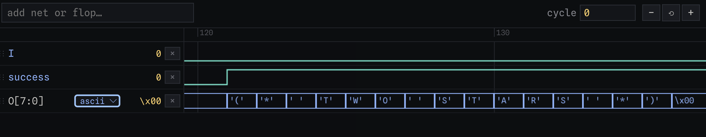

The solution can also be confirmed structurally as well. Opening the cone walker and flattening each branch we see it shows all of the forced constraints on `n6276` (and the other nets that the `success` FFs' D-input depend on) are satisfied:

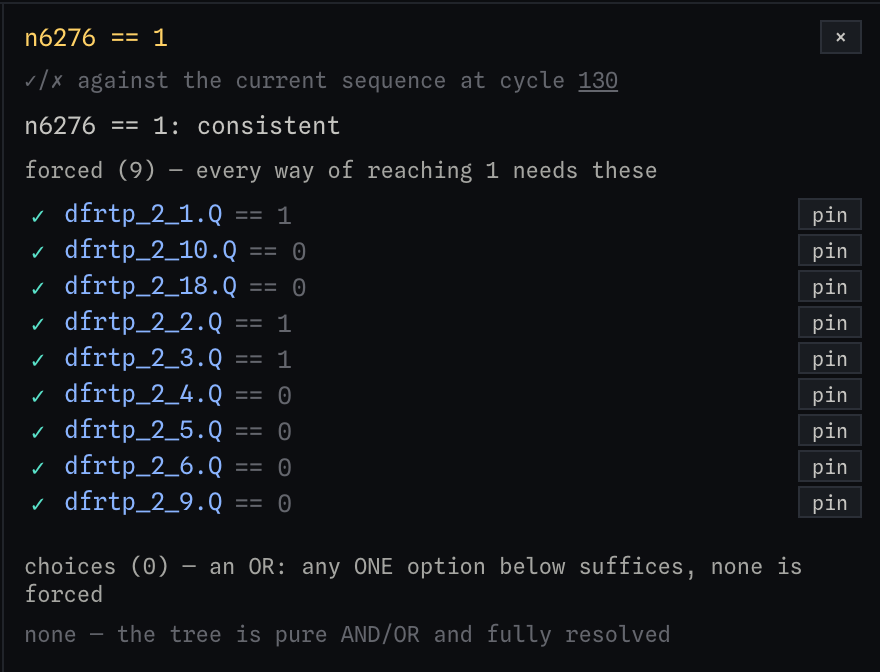

As part of the game experience, the solution can also be submitted using the "submit" button in the top toolbar, which further validates the solution:

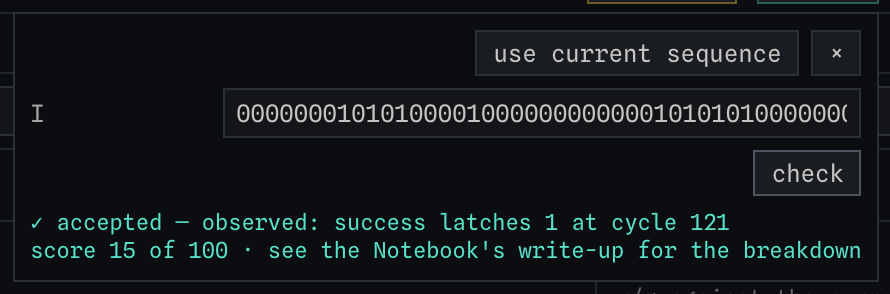

When viewed as an 11x11 grid, the solution forms the placement of stars in a two-star puzzle (the board layout of which is embedded in the design). This helps clear up the constraints from before in plainer English:

- Every row must have exactly 2 stars
- Every column must have exactly 2 stars
- Each of the 11 disjoint groups of 2-bit counters must have exactly 2 stars
- Stars cannot be adjacent to each other (up/down/left/right + 4 immediate diagonals)

The board is coloured in the easter eggs section directly below.

## Easter Eggs:

During this, I found a series of easter eggs. In no particular order:

### The timestamp on the `example_inputs.vcd`:

The timestamp is Sat Dec 31 23:59:60 2016, which is a leap second.

### Morse Code in GDS Viewer

It didn't show up when viewing the GDS using gds-viewer.tinytapeout.com, but when I added the 3D view in the game, the morse code can be seen, not even connected to the rest of the design:

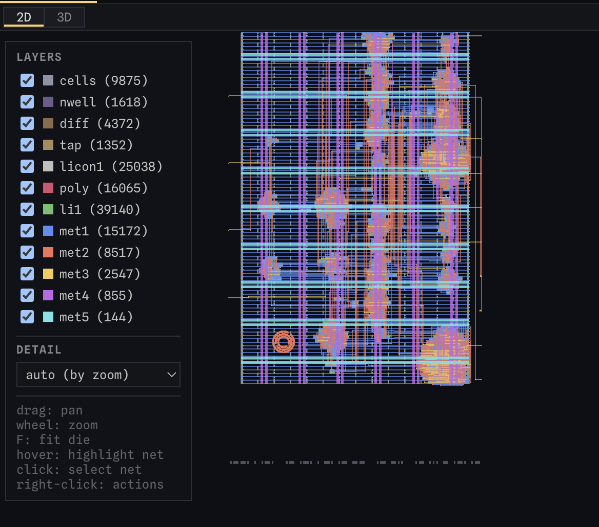

Translated, it reads "per arenam ad astra", which is Latin for "Through the arena to the stars", according to Google Translate. It's pretty close to the more common "per aspera ad astra", which is Latin for "Through hardships to the stars".

### Other Messages the Design Can Output:

In the example inputs vcd, there was the message `TRY AGAIN` on output `O[7:0]` in ASCII. Obviously after solving, the message `(* TWO STARS *)`. There were a few more I found:

- "BIG BANG" when `I` is high for all 121 cycles
- "EMPTY SKY" when `I` is low for all 121 cycles

### "JSC" in the Puzzle Grid:

When originally solving the puzzle using the Python cli tool, I derived the constraints and likened it to a mobile game called "Meowdoku", which is similar to Star Battle/Two Star, but only needs one cell per row/column (still has the same regions + spacing constraints). I coloured an 11x11 grid with the disjoint groups and the letters J S C can be seen from top left to bottom right:

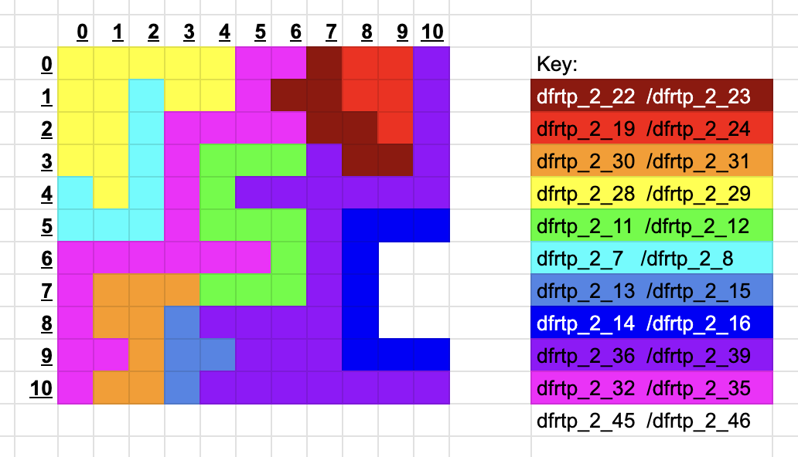

My guess is that it stands for "Jane Street Challenge" or "Jane Street Capital".

## AI Usage:

AI was used according to the challenge rules. I didn't use AI / AI Agents to solve the puzzle, just to clean up code and convert messy scripts into Python library components. The large majority of the game was implemented using AI, and implementation for the game only begun after the puzzle was solved. The write up and documentation (specifically the .md files) were all hand written. AI was used for code documentation though.

## Other Interesting resources / Reading:

- [https://siliconzoo.org/tutorial.html](https://siliconzoo.org/tutorial.html): interesting reading on reverse engineering ASICs, not directly helpful here since the .gds was provided

- [https://blog.dragonsector.pl/2017/10/?m=1](https://blog.dragonsector.pl/2017/10/?m=1): Similar CTF from 2017, used a Z3 SMT solver to recover the flag
